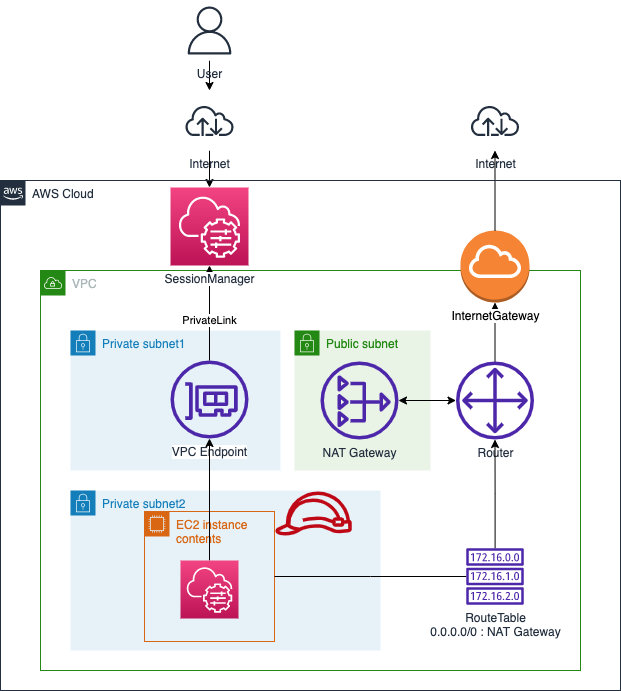

# terraform-private-ec2-ssm



## References

- [セッションマネージャーを使用してプライベートサブネットのLinux用EC2にアクセス(VPCエンドポイント編)](https://dev.classmethod.jp/articles/terraform-session-manager-linux-ec2-vpcendpoint/)
- [VPC with public and private subnet (NAT) on AWS using Terraform](https://medium.com/@kuldeep.rajpurohit/vpc-with-public-and-private-subnet-nat-on-aws-using-terraform-85a18d17c95e)

## Commands

```
$ ssh-keygen -t rsa -f example -N ''
$ terraform init
$ terraform apply
$ terraform apply -var="instance=c5.large" -var="key_name=example"
```

## How to login 
Install [SessionManager plugin](https://docs.aws.amazon.com/ja_jp/systems-manager/latest/userguide/session-manager-working-with-install-plugin.html#install-plugin-verify) if you want to use ssh.

```shell
# macos
curl "https://s3.amazonaws.com/session-manager-downloads/plugin/latest/mac/session-manager-plugin.pkg" -o "session-manager-plugin.pkg"
sudo installer -pkg session-manager-plugin.pkg -target /
sudo ln -s /usr/local/sessionmanagerplugin/bin/session-manager-plugin /usr/local/bin/session-manager-plugin
```

## Attention
Only allowed terraform applied user arn. Check [for-client.tf](./for-client.tf).